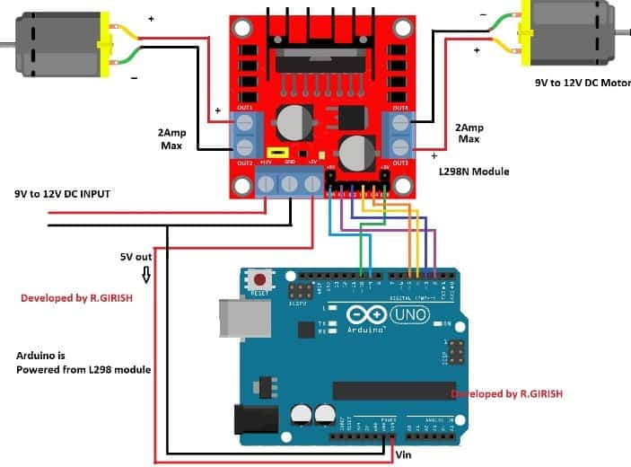
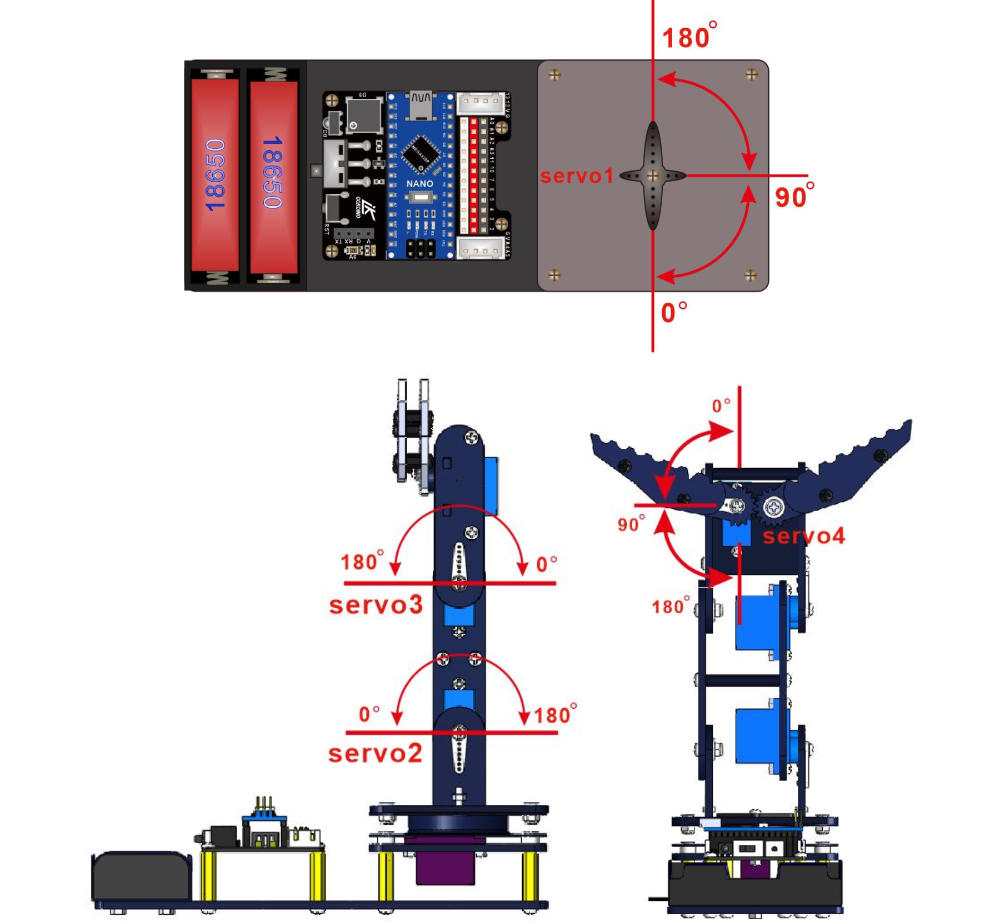

# Robotic Car Arm Controlled by iPhone


| **Engineer** | **School** | **Area of Interest** | **Grade** |
|:--:|:--:|:--:|:--:|
| Maksim R | Pinnacle High School | Mechanical Engineering | Incoming Junior


 


# Final Milestone


<iframe width="560" height="315" src="https://www.youtube.com/embed/_OPaVnnfovc?si=AyzpFt-mv50UnKPL" title="YouTube video player" frameborder="0" allow="accelerometer; autoplay; clipboard-write; encrypted-media; gyroscope; picture-in-picture; web-share" referrerpolicy="strict-origin-when-cross-origin" allowfullscreen></iframe>

## Summary

For my final milestone I added an ultrasonic sensor. This will allow the car to stop moving when it encounters something in front of it. Regardless of what direction it moving in. 

## Challenges

At times when the robot is moving the motor will work for 1-2 seconds and stop moving. After further troubleshotting i fugired out it is to do with the conectors for the ultrasonic sensor becoming loose; creating improper sensory data and making the robot belive there is something front of it. To fix this I choose pins that are less likely to become loose and added a breadboard.

## Code
```c++
#include <Servo.h>
#include <SoftwareSerial.h>

// Define servo objects
Servo yawServo;
Servo baseServo;
Servo wristServo;
Servo clawServo;

// Define servo pins
const int yawPin = 4; 
const int basePin = 5;
const int wristPin = 6;
const int clawPin = 7;

// Motor control pins
const int motor1Pin1 = 10;  // Motor 1 direction pin 1
const int motor1Pin2 = 11;  // Motor 1 direction pin 2
const int motor2Pin1 = A2;  // Motor 2 direction pin 1
const int motor2Pin2 = A3;  // Motor 2 direction pin 2
const int motor1Enable = A0; // Motor 1 enable pin
const int motor2Enable = A1; // Motor 2 enable pin

// Ultrasonic sensor pins
const int trigPin = 13;
const int echoPin = 12;

// Create SoftwareSerial object for Bluetooth
SoftwareSerial BTSerial(0, 1); // RX, TX

// Variable to track claw state
bool clawOpen = false;
int motorSpeed = 255; // Full speed by default

// Variable to track motor states
bool movingForward = false;
bool movingBackward = false;
bool movingLeft = false;
bool movingRight = false;

void setup() {
  yawServo.attach(yawPin);
  baseServo.attach(basePin);
  wristServo.attach(wristPin);
  clawServo.attach(clawPin);
  
  // Initialize servo positions
  yawServo.write(90);   // Initial position for yaw servo
  baseServo.write(90);  // Initial position for base servo
  wristServo.write(90); // Initial position for wrist servo
  clawServo.write(0);   // Initial position for claw servo (closed)

  // Set motor control pins as outputs
  pinMode(motor1Pin1, OUTPUT);
  pinMode(motor1Pin2, OUTPUT);
  pinMode(motor2Pin1, OUTPUT);
  pinMode(motor2Pin2, OUTPUT);
  pinMode(motor1Enable, OUTPUT);
  pinMode(motor2Enable, OUTPUT);
  
  // Ultrasonic sensor pins
  pinMode(trigPin, OUTPUT);
  pinMode(echoPin, INPUT);

  // Begin serial communication
  Serial.begin(9600);  
  BTSerial.begin(9600);  

  Serial.println("Send 'o' to open, 'c' to close the claw, 's' to move yaw right, 't' to move yaw left, 'a' to move base up, 'b' to move base down, 'u' to move wrist up, 'd' to move wrist down, '1' to move forward, '2' to move backward, '3' to move left, '4' to move right, '6' to increase speed, '7' to decrease speed.");
}

void moveForward() {
  digitalWrite(motor1Pin1, HIGH);
  digitalWrite(motor1Pin2, LOW);
  digitalWrite(motor2Pin1, HIGH);
  digitalWrite(motor2Pin2, LOW);
  analogWrite(motor1Enable, motorSpeed);
  analogWrite(motor2Enable, motorSpeed);
  movingForward = true;
}

void moveBackward() {
  digitalWrite(motor1Pin1, LOW);
  digitalWrite(motor1Pin2, HIGH);
  digitalWrite(motor2Pin1, LOW);
  digitalWrite(motor2Pin2, HIGH);
  analogWrite(motor1Enable, motorSpeed);
  analogWrite(motor2Enable, motorSpeed);
  movingBackward = true;
}

void moveLeft() {
  digitalWrite(motor1Pin1, HIGH);
  digitalWrite(motor1Pin2, LOW);
  digitalWrite(motor2Pin1, LOW);
  digitalWrite(motor2Pin2, HIGH);
  analogWrite(motor1Enable, motorSpeed);
  analogWrite(motor2Enable, motorSpeed);
  movingLeft = true;
}

void moveRight() {
  digitalWrite(motor1Pin1, LOW);
  digitalWrite(motor1Pin2, HIGH);
  digitalWrite(motor2Pin1, HIGH);
  digitalWrite(motor2Pin2, LOW);
  analogWrite(motor1Enable, motorSpeed);
  analogWrite(motor2Enable, motorSpeed);
  movingRight = true;
}

void stopMotors() {
  digitalWrite(motor1Pin1, LOW);
  digitalWrite(motor1Pin2, LOW);
  digitalWrite(motor2Pin1, LOW);
  digitalWrite(motor2Pin2, LOW);
  analogWrite(motor1Enable, 0);
  analogWrite(motor2Enable, 0);
  movingForward = false;
  movingBackward = false;
  movingLeft = false;
  movingRight = false;
}

void toggleClaw() {
  if (clawOpen) {
    clawServo.write(0);  // Close the claw
    Serial.println("Claw servo closed.");
  } else {
    clawServo.write(100);  // Open the claw
    Serial.println("Claw servo opened.");
  }
  clawOpen = !clawOpen;  // Toggle claw state
}

void increaseSpeed() {
  motorSpeed += 51; // Increase speed by 20%
  if (motorSpeed > 255) {
    motorSpeed = 255; // Max speed
  }
  Serial.print("Motor speed increased to ");
  Serial.println(motorSpeed);
}

void decreaseSpeed() {
  motorSpeed -= 51; // Decrease speed by 20%
  if (motorSpeed < 0) {
    motorSpeed = 0; // Min speed
  }
  Serial.print("Motor speed decreased to ");
  Serial.println(motorSpeed);
}

float getDistance() {
  digitalWrite(trigPin, LOW);
  delayMicroseconds(2);
  digitalWrite(trigPin, HIGH);
  delayMicroseconds(10);
  digitalWrite(trigPin, LOW);
  
  float duration = pulseIn(echoPin, HIGH);
  float distance = duration * 0.034 / 2;  // Speed of sound is 340 m/s, or 0.034 cm/microsecond
  
  return distance;
}

void loop() {
  // Ultrasonic sensor distance check
  float distance = getDistance();
  
  
  if (distance < 20 && movingForward == true) {  // If obstacle is detected within 15 cm, stop the motors
    stopMotors();
    Serial.print("Obstacle detected. Stopping motors. ");
    Serial.print("Distance: ");
    Serial.print(distance);
    Serial.println(" cm");
  }


  // Bluetooth commands processing
  if (BTSerial.available()) {  // Check if there's any data available on the Bluetooth serial port
    char command = BTSerial.read();  // Read the incoming byte


    // Process commands based on received characters
    if (command == 'c') {
      toggleClaw();  // Toggle claw servo position
    } else if (command == 'q') {
      stopMotors();  // Stop motors
      Serial.println("Motors stopped.");
    } else if (command == 'k') {
      int newYawPosition = yawServo.read() + 20; // Increase the yaw position
      if (newYawPosition > 180) {
        newYawPosition = 180;
      }
      yawServo.write(newYawPosition);
      Serial.print("Yaw servo moved to ");
      Serial.println(newYawPosition);
    } else if (command == 'h') {
      int newYawPosition = yawServo.read() - 20; // Decrease the yaw position
      if (newYawPosition < 0) {
        newYawPosition = 0;
      }
      yawServo.write(newYawPosition);
      Serial.print("Yaw servo moved to ");
      Serial.println(newYawPosition);
    } else if (command == 'j') {
      int newBasePosition = baseServo.read() + 15; // Move base up
      if (newBasePosition > 180) {
        newBasePosition = 180;
      }
      baseServo.write(newBasePosition);
      Serial.print("Base servo moved to ");
      Serial.println(newBasePosition);
    } else if (command == 'u') {
      int newBasePosition = baseServo.read() - 15; // Move base down
      if (newBasePosition < 0) {
        newBasePosition = 0;
      }
      baseServo.write(newBasePosition);
      Serial.print("Base servo moved to ");
      Serial.println(newBasePosition);
    } else if (command == 'i') {
      int newWristPosition = wristServo.read() + 10; // Move wrist up
      if (newWristPosition > 180) {
        newWristPosition = 180;
      }
      wristServo.write(newWristPosition);
      Serial.print("Wrist servo moved to ");
      Serial.println(newWristPosition);
    } else if (command == 'y') {
      int newWristPosition = wristServo.read() - 10; // Move wrist down
      if (newWristPosition < 0) {
        newWristPosition = 0;
      }
      wristServo.write(newWristPosition);
      Serial.print("Wrist servo moved to ");
      Serial.println(newWristPosition);
    } else if (command == 'w') { // Move forward
      if (movingForward) {
        stopMotors();
        Serial.println("Motors stopped.");
      } else {
        moveForward();
        Serial.println("Moving forward.");
      }
    } else if (command == 's') { // Move backward
      if (movingBackward) {
        stopMotors();
        Serial.println("Motors stopped.");
      } else {
        moveBackward();
        Serial.println("Moving backward.");
      }
    } else if (command == 'd') { // Move left
      if (movingLeft) {
        stopMotors();
        Serial.println("Motors stopped.");
      } else {
        moveLeft();
        Serial.println("Moving left.");
      }
    } else if (command == 'a') { // Move right
      if (movingRight) {
        stopMotors();
        Serial.println("Motors stopped.");
      } else {
        moveRight();
        Serial.println("Moving right.");
      }
    } else if (command == '1') { // Increase speed
      increaseSpeed();
    } else if (command == '2') { // Decrease speed
      decreaseSpeed();
    } 
  }
}
```

# Third Milestone


<iframe width="560" height="315" src="https://www.youtube.com/embed/mBFUxkCsP88?si=avCN9NvDMuZUEYS5" title="YouTube video player" frameborder="0" allow="accelerometer; autoplay; clipboard-write; encrypted-media; gyroscope; picture-in-picture; web-share" referrerpolicy="strict-origin-when-cross-origin" allowfullscreen></iframe>

## Summary

  For my third milestone, I added four-wheel drive to my robotic arm. Enabling the arm to travel in any setting. Furthermore, I tested the range to be up to 50+ feet with no obstructions. Additionally, the robot is all-terrain (no water). I also added underglow to my robot to add an aesthetic look. The motor driver to control the motors is powered by 6 AA batteries and powers the underglow LEDs and the motors.
  
## Complications 

  I had to alter my code to control the motors via Bluetooth significantly. Initially, I faced issues with maintaining the connection. I changed my pins for my motor's pins. I will add an ultrasonic sensor for partial crash detection for my final milestone.

## Schematics 




## Code
```c++
#include <Servo.h>
#include <SoftwareSerial.h>

// Define servo objects
Servo yawServo;
Servo baseServo;
Servo wristServo;
Servo clawServo;

// Define servo pins
const int yawPin = 4; 
const int basePin = 5;
const int wristPin = 6;
const int clawPin = 7;

// Motor control pins
const int motor1Pin1 = 8;  // Motor 1 direction pin 1
const int motor1Pin2 = 9;  // Motor 1 direction pin 2
const int motor1EnablePin = 10; // Motor 1 enable pin (ENA)
const int motor2Pin1 = A3; // Motor 2 direction pin 1
const int motor2Pin2 = A2; // Motor 2 direction pin 2
const int motor2EnablePin = 11; // Motor 2 enable pin (ENB)

// Create SoftwareSerial object for Bluetooth
SoftwareSerial BTSerial(2, 3); // RX, TX

// Variable to track claw state
bool clawOpen = false;

void setup() {
  yawServo.attach(yawPin);
  baseServo.attach(basePin);
  wristServo.attach(wristPin);
  clawServo.attach(clawPin);
  
  // Initialize servo positions
  yawServo.write(90);   // Initial position for yaw servo
  baseServo.write(90);  // Initial position for base servo
  wristServo.write(90); // Initial position for wrist servo
  clawServo.write(0);   // Initial position for claw servo (closed)

  // Set motor control pins as outputs
  pinMode(motor1Pin1, OUTPUT);
  pinMode(motor1Pin2, OUTPUT);
  pinMode(motor1EnablePin, OUTPUT);
  pinMode(motor2Pin1, OUTPUT);
  pinMode(motor2Pin2, OUTPUT);
  pinMode(motor2EnablePin, OUTPUT);

  // Begin serial communication
  Serial.begin(9600);  
  BTSerial.begin(9600);  

  Serial.println("Send 'o' to open, 'c' to close the claw, 's' to move yaw right, 't' to move yaw left, 'a' to move base up, 'b' to move base down, 'u' to move wrist up, 'd' to move wrist down, 'f' to move forward, 'b' to move backward, 'l' to move left, 'r' to move right, '1' to stop.");
}

void moveForward(int speed) {
  analogWrite(motor1EnablePin, speed);
  digitalWrite(motor1Pin1, HIGH);
  digitalWrite(motor1Pin2, LOW);
  analogWrite(motor2EnablePin, speed);
  digitalWrite(motor2Pin1, HIGH);
  digitalWrite(motor2Pin2, LOW);
}

void moveBackward(int speed) {
  analogWrite(motor1EnablePin, speed);
  digitalWrite(motor1Pin1, LOW);
  digitalWrite(motor1Pin2, HIGH);
  analogWrite(motor2EnablePin, speed);
  digitalWrite(motor2Pin1, LOW);
  digitalWrite(motor2Pin2, HIGH);
}

void moveLeft(int speed) {
  analogWrite(motor1EnablePin, speed);
  digitalWrite(motor1Pin1, HIGH);
  digitalWrite(motor1Pin2, LOW);
  analogWrite(motor2EnablePin, speed);
  digitalWrite(motor2Pin1, LOW);
  digitalWrite(motor2Pin2, HIGH);
}

void moveRight(int speed) {
  analogWrite(motor1EnablePin, speed);
  digitalWrite(motor1Pin1, LOW);
  digitalWrite(motor1Pin2, HIGH);
  analogWrite(motor2EnablePin, speed);
  digitalWrite(motor2Pin1, HIGH);
  digitalWrite(motor2Pin2, LOW);
}

void stopMotors() {
  analogWrite(motor1EnablePin, 0);
  analogWrite(motor2EnablePin, 0);
  digitalWrite(motor1Pin1, LOW);
  digitalWrite(motor1Pin2, LOW);
  digitalWrite(motor2Pin1, LOW);
  digitalWrite(motor2Pin2, LOW);
}

void toggleClaw() {
  if (clawOpen) {
    clawServo.write(10);  // Close the claw
    Serial.println("Claw servo closed.");
  } else {
    clawServo.write(100);  // Open the claw
    Serial.println("Claw servo opened.");
  }
  clawOpen = !clawOpen;  // Toggle claw state
}

void loop() {
  if (BTSerial.available()) {  // Check if there's any data available on the Bluetooth serial port
    char command = BTSerial.read();  // Read the incoming byte

    // Print the received command to the Serial Monitor
    Serial.print("Received command: ");
    Serial.println(command);

    if (command == 'o') {
      toggleClaw();  // Toggle claw servo position
    } else if (command == 'c') {
      stopMotors();  // Stop motors
      Serial.println("Motors stopped.");
    } else if (command == 's') {
      int newYawPosition = yawServo.read() + 20; // Increase the yaw position
      if (newYawPosition > 180) {
        newYawPosition = 180;
      }
      yawServo.write(newYawPosition);
      Serial.print("Yaw servo moved to ");
      Serial.println(newYawPosition);
    } else if (command == 't') {
      int newYawPosition = yawServo.read() - 20; // Decrease the yaw position
      if (newYawPosition < 0) {
        newYawPosition = 0;
      }
      yawServo.write(newYawPosition);
      Serial.print("Yaw servo moved to ");
      Serial.println(newYawPosition);
    } else if (command == 'a') {
      int newBasePosition = baseServo.read() + 20; // Move base up
      if (newBasePosition > 180) {
        newBasePosition = 180;
      }
      baseServo.write(newBasePosition);
      Serial.print("Base servo moved to ");
      Serial.println(newBasePosition);
    } else if (command == 'b') {
      int newBasePosition = baseServo.read() - 20; // Move base down
      if (newBasePosition < 0) {
        newBasePosition = 0;
      }
      baseServo.write(newBasePosition);
      Serial.print("Base servo moved to ");
      Serial.println(newBasePosition);
    } else if (command == 'u') {
      int newWristPosition = wristServo.read() + 20; // Move wrist up
      if (newWristPosition > 180) {
        newWristPosition = 180;
      }
      wristServo.write(newWristPosition);
      Serial.print("Wrist servo moved to ");
      Serial.println(newWristPosition);
    } else if (command == 'd') {
      int newWristPosition = wristServo.read() - 20; // Move wrist down
      if (newWristPosition < 0) {
        newWristPosition = 0;
      }
      wristServo.write(newWristPosition);
      Serial.print("Wrist servo moved to ");
      Serial.println(newWristPosition);
    } else if (command == 'f') { // Move forward
      moveForward(200); // Adjust speed as needed (0-255)
      Serial.println("Moving forward.");
    } else if (command == 'b') { // Move backward
      moveBackward(200); // Adjust speed as needed (0-255)
      Serial.println("Moving backward.");
    } else if (command == 'l') { // Move left
      moveLeft(200); // Adjust speed as needed (0-255)
      Serial.println("Moving left.");
    } else if (command == 'r') { // Move right
      moveRight(200); // Adjust speed as needed (0-255)
      Serial.println("Moving right.");
    } else if (command == '1') { // Stop
      stopMotors();
      Serial.println("Motors stopped.");
    } else {
      Serial.println("Unknown command.");
    }
  }
}
```


# Second Milestone


<iframe width="560" height="315" src="https://www.youtube.com/embed/5vV-AcF4DRU?si=Ut-Z7bL2yFteAWOz" title="YouTube video player" frameborder="0" allow="accelerometer; autoplay; clipboard-write; encrypted-media; gyroscope; picture-in-picture; web-share" referrerpolicy="strict-origin-when-cross-origin" allowfullscreen></iframe>

## Summary

  For my second milestone, I added Bluetooth control using an HM-10 and a Bluetooth terminal app called BluetoothLE. In the app, I preprogrammed buttons to send commands to the Bluetooth chip for easier control. I plugged the Bluetooth chip into the expansion board that came in the kit to power it.

## Challenges 

  I had to alter my code to control the robot via Bluetooth significantly. Initially, I faced issues with maintaining stable movements from the servos. I switched the base servo to a higher torque model to fix this. For my final milestone, I will construct a robot car that can also be controlled via Bluetooth, aiming to integrate the arm and car into one cohesive unit.

## Schematics 


## Code
```c++
#include <Servo.h>
#include <SoftwareSerial.h>

// Define servo objects
Servo yawServo;
Servo baseServo;
Servo wristServo;
Servo clawServo;

// Define servo pins
const int yawPin = 4; 
const int basePin = 5;
const int wristPin = 6;
const int clawPin = 7;

// Create SoftwareSerial object for Bluetooth
SoftwareSerial BTSerial(2, 3); // RX, TX

void setup() {
  yawServo.attach(yawPin);
  baseServo.attach(basePin);
  wristServo.attach(wristPin);
  clawServo.attach(clawPin);
  
  // Initialize servo positions
  yawServo.write(90);   // Initial position for yaw servo
  baseServo.write(90);  // Initial position for base servo
  wristServo.write(90); // Initial position for wrist servo
  clawServo.write(0);   // Initial position for claw servo

  // Begin serial communication
  Serial.begin(9600);  
  BTSerial.begin(9600);  

  Serial.println("Send 'o' to open, 'c' to close the claw, 's' to move yaw right, 't' to move yaw left, 'a' to move base up, 'b' to move base down, 'u' to move wrist up, and 'd' to move wrist down.");
}

void loop() {
  if (BTSerial.available()) {  // Check if there's any data available on the Bluetooth serial port
    char command = BTSerial.read();  // Read the incoming byte

    // Print the received command to the Serial Monitor
    Serial.print("Received command: ");
    Serial.println(command);

    if (command == 'o') {
      clawServo.write(100);  // Move the claw servo to 100 degrees
      Serial.println("Claw servo opened.");
    } else if (command == 'c') {
      clawServo.write(0);  // Move the claw servo to 0 degrees
      Serial.println("Claw servo closed.");
    } else if (command == 's') {
      int newYawPosition = yawServo.read() + 10; // Increase the yaw position by 10 degrees
      if (newYawPosition > 180) {
        newYawPosition = 180; // Limit to max 180 degrees
      }
      yawServo.write(newYawPosition);  // Move the yaw servo to the new position
      Serial.print("Yaw servo moved to ");
      Serial.println(newYawPosition);
    } else if (command == 't') {
      int newYawPosition = yawServo.read() - 10; // Decrease the yaw position by 10 degrees
      if (newYawPosition < 0) {
        newYawPosition = 0; // Limit to min 0 degrees
      }
      yawServo.write(newYawPosition);  // Move the yaw servo to the new position
      Serial.print("Yaw servo moved to ");
      Serial.println(newYawPosition);
    } else if (command == 'a') {
      int newBasePosition = baseServo.read() + 5; // Increase the base position by 5 degrees
      if (newBasePosition > 180) {
        newBasePosition = 180; // Limit to max 180 degrees
      }
      baseServo.write(newBasePosition);  // Move the base servo to the new position
      Serial.print("Base servo moved to ");
      Serial.println(newBasePosition);
    } else if (command == 'b') {
      int newBasePosition = baseServo.read() - 5; // Decrease the base position by 5 degrees
      if (newBasePosition < 0) {
        newBasePosition = 0; // Limit to min 0 degrees
      }
      baseServo.write(newBasePosition);  // Move the base servo to the new position
      Serial.print("Base servo moved to ");
      Serial.println(newBasePosition);
    } else if (command == 'u') {
      int newWristPosition = wristServo.read() + 5 // Increase the wrist position by 5 degrees
      if (newWristPosition > 180) {
        newWristPosition = 180; // Limit to max 180 degrees
      }
      wristServo.write(newWristPosition);  // Move the wrist servo to the new position
      Serial.print("Wrist servo moved to ");
      Serial.println(newWristPosition);
    } else if (command == 'd') {
      int newWristPosition = wristServo.read() - 5; // Decrease the wrist position by 5 degrees
      if (newWristPosition < 0) {
        newWristPosition = 0; // Limit to min 0 degrees
      }
      wristServo.write(newWristPosition);  // Move the wrist servo to the new position
      Serial.print("Wrist servo moved to ");
      Serial.println(newWristPosition);  
    } else {
      Serial.println("Unknown command. Send 'o' to open or 'c' to close the claw, 's' to move yaw right, 't' to move yaw left, 'a' to move base up, 'b' to move base down, 'u' to move wrist up, and 'd' to move wrist down.");
    }
  }
}
```
# First Milestone


<iframe width="560" height="315" src="https://www.youtube.com/embed/pl3rsx-9awk?si=rAK55ilik1rxmmjO" title="YouTube video player" frameborder="0" allow="accelerometer; autoplay; clipboard-write; encrypted-media; gyroscope; picture-in-picture; web-share" referrerpolicy="strict-origin-when-cross-origin" allowfullscreen></iframe>

## Summary

 For my first milestone, I developed a working prototype of a robotic arm powered by my MacBook and a 7.5V power supply. The Arduino Nano controls four servos (Yaw, Arm, Wrist, and Claw) based on joystick input.

## Challenges

I faced issues with powering the arm, as the servos could draw 0.5 amps, causing the system to shut down. Additionally, the servos had to be replaced due to their weakness. Despite these challenges, I controlled the base, arm, wrist, and claw movements.

## Schematics 




## Code


```c++
#include <Servo.h>

Servo yaw;
Servo base;
Servo wrist;
Servo claw;

void setup(){
    yaw.attach(4);
    base.attach(5);
    wrist.attach(6);
    claw.attach(7);
    Serial.begin(9600);
} 

int process_joystick(int reading){
  int new_reading = reading / 100;
  new_reading  = new_reading - 5;
  if (new_reading >= -2 && new_reading <= 2){
    new_reading = 0;
  }
  return new_reading;
}

void loop(){
  int LX = process_joystick(analogRead(A0));
  int LY = process_joystick(analogRead(A1));
  int RX = process_joystick(analogRead(A2));
  int RY = process_joystick(analogRead(A3));
  yaw.write(yaw.read()+ LX);
  base.write(base.read() + LY);
  wrist.write(wrist.read()+ RX);
  claw.write(claw.read()+ RY);
  delay(30);
}
```
# Starter Project


<iframe width="560" height="315" src="https://www.youtube.com/embed/u_1_Iifu6B8?si=Js_suB589OoiJRmY" title="YouTube video player" frameborder="0" allow="accelerometer; autoplay; clipboard-write; encrypted-media; gyroscope; picture-in-picture; web-share" referrerpolicy="strict-origin-when-cross-origin" allowfullscreen></iframe>

## Overview

- I created a Light Emitting Diode that is controlled by a board
- It has 5 parts: 1 LED, 3 sliders, 1 PCB
- Soldering with different soldering iron

## Summary
- Light-emitting diodes work by having three smaller lights inside. One red, one blue, and one green. Each light is controlled via voltage to control its brightness. Together, this creates a light that can be any color. In this project, the user controls the light via sliders.  


# Bill of Materials

| **Part** | **Note** | **Price** | **Link** |
|:--:|:--:|:--:|:--:|
| Robotic Arm Kit | Robotic Arm | $50 | <a href="https://www.amazon.com/LK-COKOINO-Compliment-Engineering-Technology/dp/B081FG1JQ1/ref=sr_1_10?crid=WOVIRMUC5Z0N&dib=eyJ2IjoiMSJ9.34Z0NK-7tSRlaNAlEFUFR30lLL7YyVqbvCA9h-Gjk9lg98-cVnL7IoihuMZ1NLulfPu4A33dcLUkdV4FMVKQzGmHKOjyC3khE2RnTvbq9Qmu3NVuOqUGokqjZx8w28kHw9LUvCCfNP2LdsIhP8B4cq-UOlRJB6hbbayc4aKvbVP3EVDO2ugA9RYGlOcbtSNnCar8YyC1J981eHntgxodqxtIse-nj_I4FizvDMBAdc533N9XJewmk_JyNJQpmeqY_aEdWnBpre4sMiA1cnclOt_xkXSdBOktCfimR-gg59M.JDhe_QES4oqdcs7qz0fcG3TF8GqKf9Q8y3arV6O4D0E&dib_tag=se&keywords=robotic+arm+cokion&qid=1720630693&sprefix=robotic+arm+cokion%2Caps%2C120&sr=8-10"> Link </a> |
| HM-10 | Bluethooth Chip | $12 | <a href="https://a.co/d/0jb6O9Ao"> Link </a> |
| 2x L298n | Motor Driver | $7 | <a href="https://a.co/d/0T7SKFO"> Link </a> |
| RED LED | Lights | $16 | <a href="https://a.co/d/5lpHaMW"> Link </a> |
| UltraSonic Sensor | Measures Distance | $7 | <a href="https://a.co/d/euodlKd"> Link </a> |


<!-- 
# Other Resources/Examples
One of the best parts about Github is that you can view how other people set up their own work. Here are some past BSE portfolios that are awesome examples. You can view how they set up their portfolio, and you can view their index.md files to understand how they implemented different portfolio components.
- [Example 1](https://trashytuber.github.io/YimingJiaBlueStamp/)
- [Example 2](https://sviatil0.github.io/Sviatoslav_BSE/)
- [Example 3](https://arneshkumar.github.io/arneshbluestamp/)

To watch the BSE tutorial on how to create a portfolio, click here. -->
